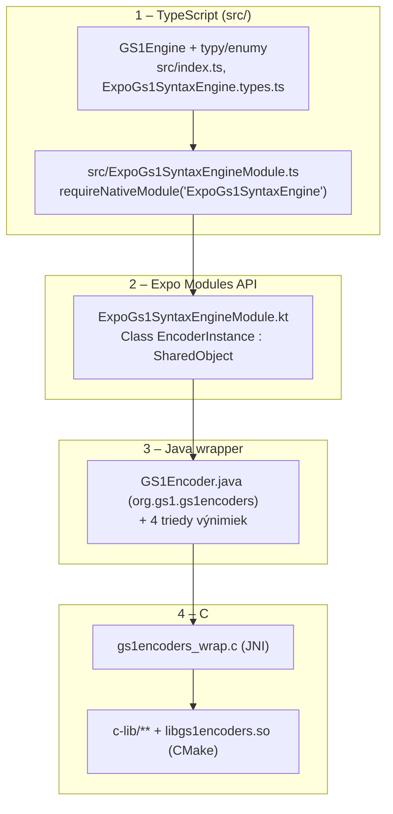
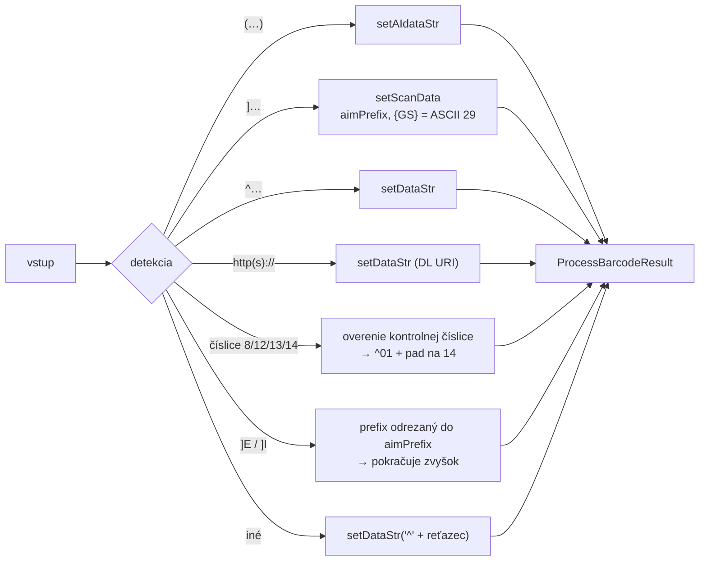
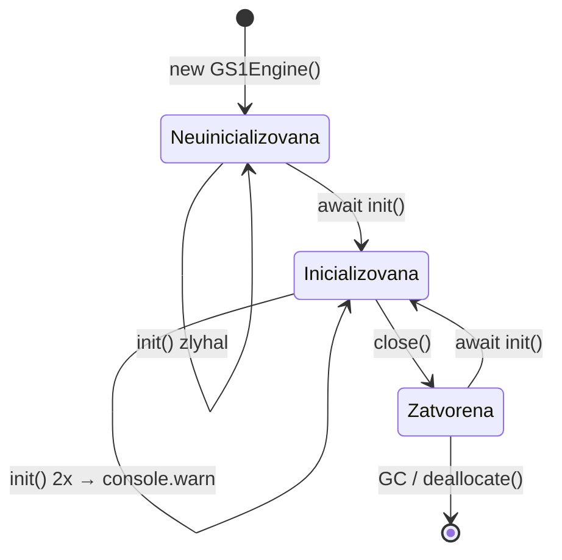
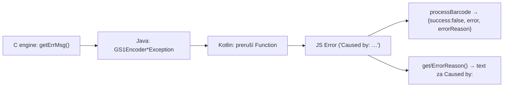

# SPECS – aktuálny kontext projektu `expo-gs1-syntax-engine`

> Súhrnný špecifikačný kontext projektu zostavený z dokumentácie v [`docs/`](./docs/).
> Platnosť: k stavu repozitára k dátumu vydania tejto verzie. Detailné popisy sú v jednotlivých kapitolách dokumentácie.

---

## 1. Identita projektu

| Položka | Hodnota |
|---------|---------|
| Názov balíka | `expo-gs1-syntax-engine` |
| Verzia balíka | `0.1.8` |
| Verzia GS1 Barcode Syntax Engine | `1.4.1` |
| Licencia modulu | MIT |
| Licencia GS1 enginu | Apache License 2.0 (GS1 AISBL) – [`NOTICE`](./NOTICE) |
| Autor | Viliam / GS1 Slovakia (`GS1SlovakiaOrg`) |
| Repozitár | <https://github.com/GS1SlovakiaOrg/expo-gs1-syntax-engine> |
| Príkladová aplikácia | <https://github.com/GS1SlovakiaOrg/expo-gs1-s-e-example> (+ [`example/`](./example/)) |
| Vstupný bod | `build/index.js` (`main`), typy `build/index.d.ts` |
| Povaha | Nezávislý projekt, **nie oficiálny balík GS1 AISBL**, „as-is“ bez záruky podpory |

---

## 2. Účel modulu

Expo natívny modul, ktorý obaľuje [GS1 Barcode Syntax Engine](https://github.com/gs1/gs1-syntax-engine) a poskytuje z JS:

- validáciu dát GS1 Application Identifiers (linter: dátum, krajina, mena, kontrolné číslice, ISO 4217/3166, IBAN, …),
- parsovanie naskenovaných dát s AIM prefixom,
- generovanie **HRI** (Human-Readable Interpretation),
- generovanie aj parsovanie **GS1 Digital Link URI**,
- konverziu medzi formátmi: bracketed AI syntax ↔ raw AI syntax ↔ scan data ↔ DL URI,
- detekciu symbology (len pri scan data),
- výpočet GS1 kontrolnej číslice.

---

## 3. Podpora platforiem

| Platforma | Stav |
|-----------|------|
| **Android** | ✅ jediná plne implementovaná platforma (`expo-module.config.json` → `"platforms": ["android"]`) |
| iOS | ❌ nie je implementované (neexistuje priečinok `ios/`) |
| Web | ⚠️ len placeholder (`ExpoGs1SyntaxEngineModule.web.ts` – prázdny modul, API nie je volateľné) |
| Expo Go | ❌ nepodporované – vyžaduje development build (`npx expo run:android`) |

**Závislosti:** `expo ^57.0.16`, `react-native ^0.86.2`, `react 19.2.3`, TypeScript `~6.0.3` (dev).

---

## 4. Architektúra (aktuálny stav)

| Vrstva | Kľúčové súbory |
|--------|----------------|
| TypeScript | `src/index.ts` (trieda `GS1Engine`), `src/ExpoGs1SyntaxEngine.types.ts`, `src/ExpoGs1SyntaxEngineModule.ts`, `src/ExpoGs1SyntaxEngineModule.web.ts` |
| Kotlin | `android/src/main/java/expo/modules/gs1syntaxengine/ExpoGs1SyntaxEngineModule.kt` |
| Java | `.../GS1Encoder.java`, `GS1Encoder{General,Parameter,ScanData,DigitalLink}Exception.java` |
| C (JNI) | `android/src/main/cpp/gs1encoders_wrap.c`, `CMakeLists.txt` |
| C (engine) | `android/src/main/c-lib/` (`gs1encoders.c`, `ai.c`, `dl.c`, `scandata.c`, `syn.c`, `syntax/*`) |

**Preklad:** `init()` je jediná `AsyncFunction`; všetky ostatné funkcie sú synchronné `Function` volania cez bridge.

---

## 5. Verejné API (aktuálny rozsah)

### Exporty

`GS1Engine` (trieda), `Symbology`, `Validation`, `InitOptions`, `ProcessBarcodeResult`, `AIDataPairs`, `ParsedGS1AIData`, `BarcodeInputType`.

### Vlastnosti `GS1Engine`

| Vlastnosť | Typ | Default |
|-----------|-----|---------|
| `isInitialized` | `boolean` (read-only) | `false` |
| `version` | `string` (read-only) | dátum buildu C knižnice |
| `initFallbackWarning` | `string \| null` (read-only) | `null` |
| `sym` | `Symbology` (get/set) | – |
| `addCheckDigit` | `boolean` (get/set) | `false` |
| `includeDataTitlesInHRI` | `boolean` (get/set) | `false` |
| `permitUnknownAIs` | `boolean` (get/set) | `false` |
| `permitZeroSuppressedGTINinDLuris` | `boolean` (get/set) | `false` |

### Metódy

| Metóda | Návrat | Poznámka |
|--------|--------|----------|
| `init(options?)` | `Promise<void>` | asynchrónna; opakované volanie varuje a nerobí re-init |
| `close()` | `void` | idempotentné, uvoľní natívny kontext |
| `get/setValidationEnabled(validation, value)` | `boolean` / `void` | platí len pre AI vstupy |
| `getDataStr/setDataStr` | `string` / `void` | raw dáta (FNC1 ako `^`), podpora DL URI a kompozitov (`\|`) |
| `getAIdataStr/setAIdataStr` | `string \| null` / `void` | bracketed AI syntax, escape `\\(` |
| `getScanData/setScanData` | `string` / `void` | AIM prefix, `{GS}` = ASCII 29 |
| `getErrMarkup()` | `string` | markup vinných znakov, `''` = bez chyby |
| `getDLuri(stem?)` | `string` | default stem `https://id.gs1.org/` |
| `getHRI()` | `string[]` | kompozit: riadok `--` |
| `getDLignoredQueryParams()` | `string[]` | necislové query parametre, nie sú dekódované |
| `processBarcode(data, dlStem?)` | `ProcessBarcodeResult` | univerzálna metóda modulu, **nevyhadzuje** |
| `getEngineResultData(dlStem?, isScannedData?, aimPrefix?)` | `ProcessBarcodeResult` | zostaví výsledok z aktuálneho stavu |
| `getErrorReason(err)` | `string` | text za `Caused by:` |
| `parseHRIString(input)` | `ParsedGS1AIData \| null` | vzor `^(.*?)\s*\((\d+)\)\s*(\S+)$` |
| `calculateCheckDigit(s)` | `number` | modul 10, váha 3/1 |

### Enumy

- **`Symbology`**: `NONE=-1`, `DataBarOmni=0` … `DotCode=14`, `NUMSYMS=15`
- **`Validation`**: `MutexAIs=0` 🔒, `RequisiteAIs=1` ✅ default on, `RepeatedAIs=2` 🔒, `DigSigSerialKey=3` 🔒, `UnknownAInotDLattr=4` ✅ default on, `NUMVALIDATIONS=5`

### `InitOptions`

| Pole | Default | Význam |
|------|---------|--------|
| `syntaxDictionary` | `null` | cesta k GS1 Syntax Dictionary (inak embedded AI tabuľka) |
| `fallbackOnSyndictError` | `false` | pri zlyhaní načítania použiť embedded tabuľku |
| `noEmbedded` | `false` | zakázať embedded tabuľku (môže spôsobiť zlyhanie init) |

---

## 6. Spracovanie vstupu (`processBarcode`)

`ProcessBarcodeResult` polia: `success`, `error`, `errorReason`, `errorMarkup`, `dataStr`, `aiDataStr`, `hri`, `dlUri`, `aiDataPairs`, `aiOrder`, `symbology`, `symbologyName`, `scanData`, `aimPrefix`.

⚠️ `symbology` / `symbologyName` / `scanData` sú `null` pri všetkých formátoch okrem scan data.

---

## 7. Životný cyklus a pamäť

- Pred `init()` (a po `close()`) hádžu všetky členy `Error`.
- Kotlin `EncoderInstance.deallocate()` pri GC automaticky zavrie encoder.
- Odporúčaný vzor: `useEffect` → `init()`, cleanup → `close()`.
- **Thread safety:** len 1 inštancia = 1 vlákno (gettery mutujú interné buffery).

---

## 8. Chybový model

| Hlásenie | Príčina |
|----------|---------|
| `GS1 Syntax Engine instance has not been initialized. Call init() first` | API pred `init()` |
| `GS1 Syntax Engine has been initialized.` | opakované `init()` (varovanie, bez re-init) |
| `Failed to initialize GS1Encoder: …` | zlyhanie natívnej inicializácie |
| `GS1Encoder instance has been closed` | volanie po `close()` |
| `Unknown validation value: N` | neplatný enum `Validation` |
| `Incorrect numeric check digit` | číselný vstup 8/12/13/14 so zlou kontrolnou číslicou |

---

## 9. Obmedzenia (aktuálne známe)

1. Len Android; iOS a web nie sú funkčné; Expo Go nepodporované.
2. `symbology` iba pri scan data (prefix `]`); `]E`/`]I` sa odrežie do `aimPrefix`.
3. `parseHRIString()` neparsuje hodnoty AI **s medzerami** → také páry chýbajú v `aiDataPairs`.
4. `aiOrder` môže obsahovať dierové pozície (v JSON = `null`); `aiDataPairs` prepisuje duplicitné AI.
5. `version` vracia dátum buildu C knižnice, nie semver.
6. `get*` sú synchronné cez bridge – nevolajte ich v render cykle.
7. Bez `close()` ostáva C kontext alokovaný (riziko úniku pamäte).
8. `permitUnknownAIs` neplatí pre raw (nebracketed) vstupy; zero-suppressed GTIN sú deprecated.
9. `BarcodeInputType` je exportovaný, ale vnútorným kódom nepoužívaný.
10. `get/setValidateAIassociations` (deprecated v Jave) **nie sú** cez Kotlin exportované.

---

## 10. Vývoj, build, test

| Príkaz | Funkcia |
|--------|---------|
| `npm run build` | `tsc` (na TTY pridá `--watch`; pre CI: `CI=1 npm run build`) |
| `npm run clean` | zmaže `build/` |
| `npm run lint` | `eslint src/` ⚠️ config rozširuje `@react-native-community`, ktoré nie je v `devDependencies` |
| `npm test` | ⚠️ volá `jest`, ktorý **nie je nainštalovaný** (odstránený vo `v0.1.6`) – unit testy neexistujú |
| `npm run prepare` | clean + `tsc` (pred publikáciou) |
| `npm run open:android` / `open:ios` | otvorí `example/android` (resp. `example/ios`, ktoré neexistuje) |
| `cd example && npx expo run:android` | spustenie príkladovej aplikácie s modulom |

**Testy C enginu** (`gs1encoders-test.c`, fuzzery) bežia len na desktopi cez `Makefile`/`.vcxproj`, nie cez Android build.

**Publikovanie:** `.npmignore` vylučuje `example/`, `internal/module_scripts/`, `android/build`, `.cxx`, testy; zahŕňa `build/`, `src/`, `android/` (vrátane C zdrojov).

**Aktualizácia enginu (podľa `android/**/readme.md`):** 1) `cpp/gs1encoders_wrap.c` z `/src/java/gs1encoders_wrap.c`, 2) `c-lib/` z `/src/`, 3) java wrapper z `/src/java/org/gs1/gs1encoders` → potom overiť C API podpisy, zhodu enumov (C ↔ Java ↔ TS) a prečistiť `android/build` + `.cxx`.

---

## 11. Zmeny (posledné verzie)

| Verzia | Zmena |
|--------|-------|
| `0.1.8` | aktuálna (`package.json`) |
| `0.1.7` | `AIDataPairs`, `ParsedGS1AIData`, `parseHRIString`, oprava parsovania HRI |
| `0.1.6` | ⚠️ breaking: `aiDataPairs[ai] = {value, name}`; `NOTICE`; odstránený jest |
| `0.1.5` | `getErrorReason()`, `aimPrefix`, `errorReason` vo výsledku |
| `0.1.4` | reorganizácia repozitára, závislosti, komentáre |
| `0.1.1` | prvé vydanie |

Úplný záznam: [`changelog.md`](./changelog.md).

---

## 12. Roadmap / otvorené položky

| Téma | Stav |
|------|------|
| Podpora iOS | ❌ nerealizované (Swift/ObjC wrapper + `platforms` + iOS build) |
| Web (WASM/emscripten) | ❌ nerealizované (C kód už obsahuje `__EMSCRIPTEN__` vetvy) |
| Unit testy JS | ❌ chýbajú – vrátiť `jest` a pokryť `processBarcode`, `parseHRIString`, `calculateCheckDigit`, `getErrorReason` |
| Lint konfigurácia | ⚠️ chýbajúci `@react-native-community` eslint balík |

---

## 13. Dokumentácia

| Súbor | Obsah |
|-------|-------|
| [`docs/README.md`](./docs/README.md) | index dokumentácie |
| [`docs/01-uvod-a-prehlad.md`](./docs/01-uvod-a-prehlad.md) | úvod, prehľad, verzie, licencie |
| [`docs/02-instalacia-a-konfiguracia.md`](./docs/02-instalacia-a-konfiguracia.md) | inštalácia, platformy, konfigurácia |
| [`docs/03-architektura.md`](./docs/03-architektura.md) | vrstvy, sekvencie, životný cyklus, pamäť |
| [`docs/04-api-reference.md`](./docs/04-api-reference.md) | referencia `GS1Engine` |
| [`docs/05-datove-typy-a-enums.md`](./docs/05-datove-typy-a-enums.md) | typy, enumy, `ProcessBarcodeResult` |
| [`docs/06-priklady-pouzitia.md`](./docs/06-priklady-pouzitia.md) | príklady a formáty vstupov |
| [`docs/07-riesenie-problemov.md`](./docs/07-riesenie-problemov.md) | chyby, obmedzenia, FAQ |
| [`docs/08-nativna-vrstva-android.md`](./docs/08-nativna-vrstva-android.md) | Kotlin/Java/C vrstva, aktualizácia enginu |
| [`docs/09-vyvoj-a-testovanie.md`](./docs/09-vyvoj-a-testovanie.md) | vývoj, build, príkladová app, publikovanie |

Obrázky v repozitári (`example/assets/icon.png`, `splash-icon.png`, `favicon.png`, `android-icon-*.png`) sú len brandové – pre funkciu modulu nie sú relevantné.
