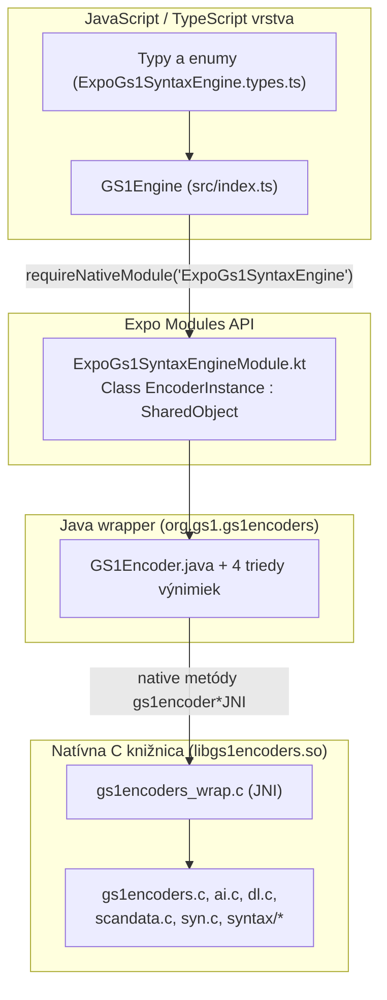
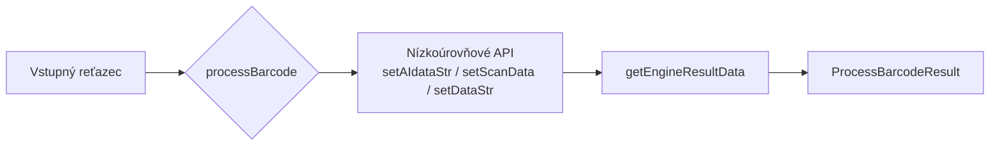

# 01 – Úvod a prehľad

## Čo je expo-gs1-syntax-engine

**expo-gs1-syntax-engine** je Expo modul (vytvorený šablónou [`create-expo-module`](https://docs.expo.dev/modules/native-module-tutorial/)), ktorý v sebe zahŕňa [GS1 Barcode Syntax Engine](https://github.com/gs1/gs1-syntax-engine) a sprístupňuje ho aplikáciám postaveným na [Expo](https://docs.expo.dev/) a [React Native](https://reactnative.dev/).

Ide o **natívny modul** – finálna práca prebieha v C knižnici, nie v JavaScripte. JavaScriptová vrstva je tenký obal (wrapper), ktorý:

1. vytvára a spravuje životný cyklus natívnej inštancie `GS1Encoder`,
2. prevádza dáta medzi JS a Kotlin/Java vrstvou,
3. pridáva nad rámec pôvodného API niekoľko pomocných metód (`processBarcode`, `getEngineResultData`, `parseHRIString`, `calculateCheckDigit`, `getErrorReason`).

> Toto je nezávislý projekt a **nie je oficiálny balík GS1 AISBL**. Poskytovaný je bez záruky podpory.

## Na čo modul slúži

| Funkcia | Popis |
|---------|-------|
| **Validácia AI dát** | Kontrola syntaxisu GS1 Application Identifiers podľa GS1 General Specifications (linter: kontroly dátumu, krajiny, meny, kontrolnej číslice atď.) |
| **Parsovanie skenov** | Spracovanie naskenovaných dát s AIM prefixom (`]C1`, `]d2`, `]e0` …) |
| **HRI** | Generovanie Human-Readable Interpretation – čitateľného zobrazenia dát z kódu |
| **GS1 Digital Link** | Generovanie aj parsovanie GS1 DL URI |
| **Konverzia formátov** | Medzi formátmi: bracketed AI syntax, unbracketed (raw) AI syntax, scan data a DL URI |
| **Detekcia symbology** | Určenie typu symbology z AIM prefixu (len pri `scanData`) |
| **Kontrolná číslica** | Výpočet GS1 kontrolnej číslice (GTIN) |

## Vrstvy projektu

Podrobnosti: [03-architektura.md](./03-architektura.md).

## Kľúčové vlastnosti

| Vlastnosť | Hodnota |
|-----------|---------|
| Verzia balíka | `0.1.8` |
| Verzia GS1 Barcode Syntax Engine | `1.4.1` |
| Vstupný bod | `build/index.js` (`main`), typy `build/index.d.ts` |
| Exportované API | `GS1Engine`, `Symbology`, `Validation`, `InitOptions`, `BarcodeInputType`, `ProcessBarcodeResult`, `AIDataPairs`, `ParsedGS1AIData` |
| Podporované platformy | **Android** (jediná natívne implementovaná platforma) |
| Licencia modulu | MIT |
| Licencia GS1 Syntax Engine | Apache License 2.0 (GS1 AISBL) |
| Repozitár | <https://github.com/GS1SlovakiaOrg/expo-gs1-syntax-engine> |
| Vzorová aplikácia | <https://github.com/GS1SlovakiaOrg/expo-gs1-s-e-example> (a `example/` v repozitári) |

## Thread safety

Podľa dokumentácie GS1 Syntax Engine je knižnica **thread-safe za predpokladu, že každé vlákno pracuje s vlastnou inštanciou `GS1Encoder`**. To platí aj pre *gettery*, ktoré mutujú interné buffery natívneho kontextu.

> ⚠️ **Z praxe:** zdieľanie jednej inštancie `GS1Engine` medzi viacerými vláknami alebo súbežné volania `set*` + `get*` z rôznych miest môžu viesť k nekonzistentným výsledkom. Používajte jednu inštanciu na jedno vlákno / jednu „pracovnú jednotku“.

## Prístup k API

API má dve vrstvy:

1. **Nízkoúrovňové API** – 1:1 zrkadlenie `GS1Encoder.java` (`setScanData`, `getHRI`, `getDLuri`, …). Vynúti nastavenie vstupu a následné čítanie výstupov.
2. **Vysokoúrovňové API** – metóda `processBarcode()`, ktorá sama rozpozná formát vstupu, nastaví správny setter a vráti kompletný výsledný objekt.

## Verzie a zmeny

| Verzia | Zmena |
|--------|-------|
| `0.1.8` | Aktuálna verzia (`package.json`) |
| `0.1.7` | Pridané typy `AIDataPairs`, `ParsedGS1AIData`, metóda `parseHRIString`, oprava parsovania HRI |
| `0.1.6` | ⚠️ **Breaking:** `aiDataPairs[ai] = {value, name}` namiesto reťazca; pridaný `NOTICE` |
| `0.1.5` | `getErrorReason()`, `aimPrefix` a `errorReason` vo výsledku |
| `0.1.4` | Reorganizácia koreňového priečinka, závislosti, komentáre |
| `0.1.3` | Úpravy `package.json` |
| `0.1.2` | Republikácia bez zmien |
| `0.1.1` | Prvé vydanie |

Úplný changelog: [`../changelog.md`](../changelog.md).

## Licencie a tretia strana

- **Modul:** MIT (pozri [`../LICENSE`](../LICENSE)).
- **GS1 Barcode Syntax Engine:** Copyright (c) GS1 AISBL, Apache License 2.0 – <https://www.apache.org/licenses/LICENSE-2.0>. Uvedené v [`../NOTICE`](../NOTICE).
