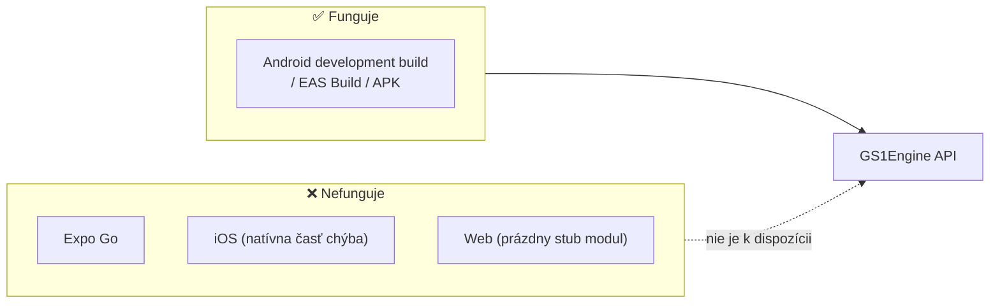

# 02 – Inštalácia a konfigurácia

## Systémové požiadavky

| Požiadavka | Hodnota |
|------------|---------|
| Expo SDK | 57 (overené: `expo ^57.0.16`) |
| React Native | 0.86 (overené: `react-native ^0.86.2`) |
| React | 19.2 (overené: `react 19.2.3`) |
| TypeScript | ~6.0 (len pre vývoj modulu) |
| Platforma | **Android** (minimálna verzia vychádza z konfigurácie hostiteľského projektu) |
| Node.js | akákoľvek podporovaná verziou Expo CLI |
| Nástroje pre Android build | Android Studio, JDK, CMake ≥ 3.22 (bundleuje sa cez Android Gradle Plugin) |

> ⚠️ **Expo Go nepodporuje** vlastné natívne moduly. Na použitie tohto modulu potrebujete *development build* (`npx expo run:android`, prípadne EAS Build).

## Podpora platforiem

| Platforma | Stav | Poznámka |
|-----------|------|----------|
| **Android** | ✅ plne podporovaná | `expo-module.config.json` → `"platforms": ["android"]` |
| **iOS** | ❌ nie je implementovaná | V repozitári neexistuje priečinok `ios/`; `npx expo install ios` by modul nenašiel |
| **Web** | ⚠️ len placeholder | `src/ExpoGs1SyntaxEngineModule.web.ts` registruje prázdny modul bez funkcií; API nie je volateľné |
| **Expo Go** | ❌ nie je podporované | Vyžaduje development build |



## Inštalácia

### Expo projekt

```bash
npx expo install expo-gs1-syntax-engine
```

### React Native projekt (bare)

Ak inštalujete do existujúceho [React Native projektu](https://docs.expo.dev/bare/overview/), najprv [nainštalujte Expo moduly](https://docs.expo.dev/bare/installing-expo-modules/):

```bash
npm install expo-gs1-syntax-engine
```

### Overenie inštalácie

```tsx
import { GS1Engine } from 'expo-gs1-syntax-engine';

async function check() {
  const enc = new GS1Engine();
  await enc.init();
  console.log('Verzia engine (dátum buildu):', enc.version);
  console.log('Varovanie pri použití fallbacku:', enc.initFallbackWarning); // null ak žiadne
  enc.close();
}
```

Ak `init()` zlyhá s hlásením o chýbajúcej natívnej triede, modul nie je prelinkovaný – pozri [07-riesenie-problemov.md](./07-riesenie-problemov.md).

## Konfigurácia modulu

### `expo-module.config.json`

```json
{
  "platforms": ["android"],
  "android": {
    "modules": ["expo.modules.gs1syntaxengine.ExpoGs1SyntaxEngineModule"]
  }
}
```

Expo autolinking načíta uvedenú Kotlin triedu. Žiadna ďalšia konfigurácia v `app.json`/`app.config.js` nie je potrebná.

### `android/build.gradle`

```gradle
plugins {
  id 'com.android.library'
  id 'expo-module-gradle-plugin'
}

android {
  namespace "expo.modules.gs1syntaxengine"
  externalNativeBuild {
    cmake {
      path file('src/main/cpp/CMakeLists.txt')
    }
  }
}
```

CMake skompiluje C zdroje do zdieľanej knižnice `libgs1encoders.so` pre každú ABI cieľovej aplikácie.

### Hostiteľský projekt (príklad v `example/`)

Príkladová aplikácia preberá modul priamo z repozitára cez autolinking:

```json
{
  "dependencies": { "expo-gs1-syntax-engine": "file:.." },
  "expo": { "autolinking": { "nativeModulesDir": ".." } }
}
```

## TypeScript

Modul dodáva vlastné deklarácie (`build/index.d.ts`) a je plne typovaný. V `tsconfig.json` hostiteľského projektu nie sú potrebné žiadne špeciálne voľby.

```ts
import {
  GS1Engine,
  Symbology,
  Validation,
  InitOptions,
  ProcessBarcodeResult,
  AIDataPairs,
  ParsedGS1AIData,
  BarcodeInputType,
} from 'expo-gs1-syntax-engine';
```

## Závislosti

| Typ | Závislosti |
|-----|------------|
| `dependencies` | `react` |
| `peerDependencies` | `expo`, `react`, `react-native` |
| `devDependencies` | `expo`, `react-native`, `typescript`, `eslint`, `prettier`, `babel-preset-expo` |

⚠️ V `package.json` je veľké množstvo `overrides`/`resolutions` prepisujúcich staré nepriame závislosti (typicky `npm:@socketregistry/...`). Ide o ochranu proti zraniteľnostiam starých závislostí transitive stromu a pri upgrade závislostí ich môže byť potrebné prehodnotiť.
