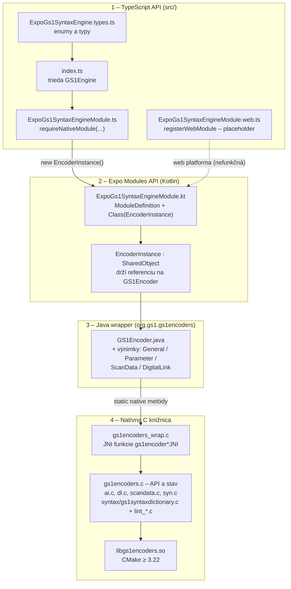
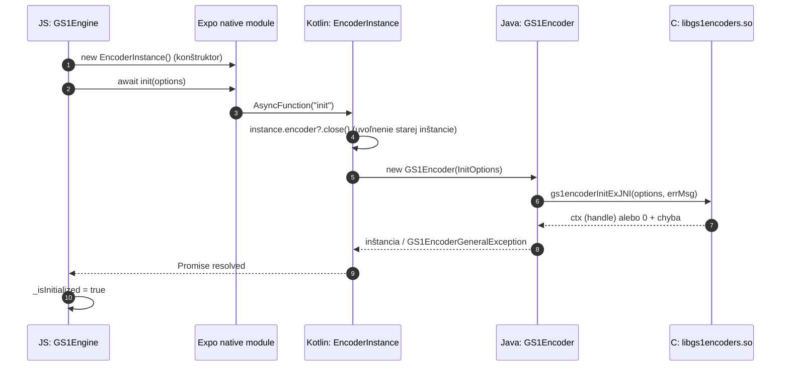
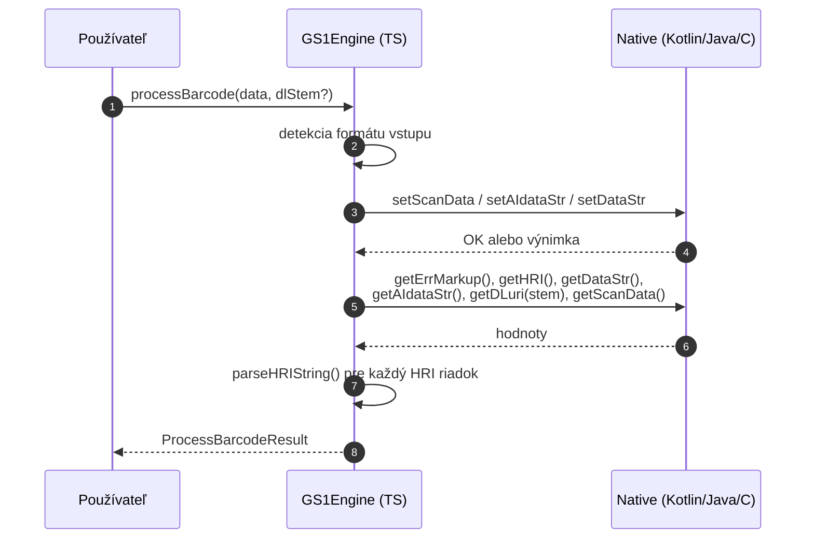
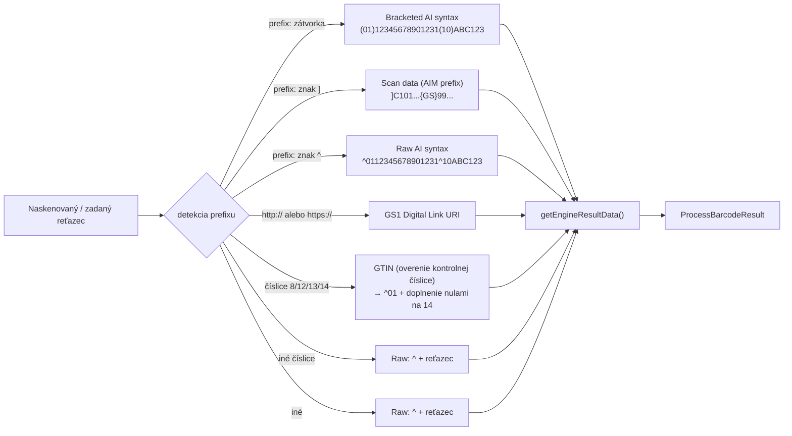
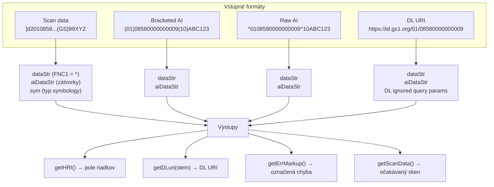
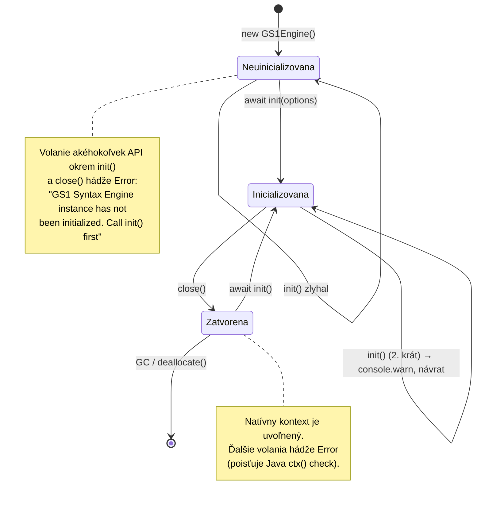
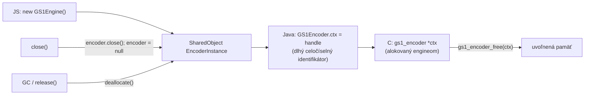
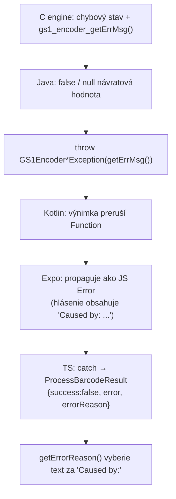

# 03 – Architektúra

## Prehľad vrstiev

Modul má štyri hlavné vrstvy (posledná C vrstva je ďalej rozdelená na JNI most a samotný engine). Každá vrstva rieši len svoju úlohu a prevádza volania o úroveň nižšie.



| Vrstva | Súbory | Úloha |
|--------|--------|-------|
| TypeScript | `src/index.ts`, `src/ExpoGs1SyntaxEngine.types.ts`, `src/ExpoGs1SyntaxEngineModule.ts` | Verejné API, kontrola stavu (`ensureInitialized`), zostavenie výsledného objektu, detekcia formátu vstupu |
| Expo (Kotlin) | `android/.../ExpoGs1SyntaxEngineModule.kt` | Registrácia modulu, prevod int ↔ enum, správa životného cyklu zdieľovaného objektu |
| Java | `android/.../GS1Encoder.java` + `GS1Encoder*Exception.java` | Typovo bezpečné API nad JNI, prevod chýb natívnej knižnice na výnimky |
| C (JNI) | `android/src/main/cpp/gs1encoders_wrap.c` | Marshalling reťazcov/boolov medzi Java a C |
| C (engine) | `android/src/main/c-lib/**` | Samotný GS1 Barcode Syntax Engine: parsovanie, linter, HRI, DL URI |

## Volanie API – sekvencia

### Inicializácia



### Spracovanie skenu (`processBarcode`)



> ⚠️ `getHRI()`, `getDataStr()`, `getDLuri()` sú **synchronné** volania cez bridge. `init()` je jediná `AsyncFunction`.

## Tok dát: formáty, ktoré engine pozná



Konkrétne príklady vstupov: [06-priklady-pouzitia.md](./06-priklady-pouzitia.md).

## Transformácia dát v engine



## Životný cyklus inštancie



### Pravidlá životného cyklu

| Situácia | Správanie |
|----------|-----------|
| `init()` pred zavolaním | `Error: GS1 Syntax Engine instance has not been initialized. Call init() first` |
| Opakované `init()` | `console.warn('GS1 Syntax Engine has been initialized.')`, **bez re-inicializácie**, návrat |
| `init()` po `close()` | opäť inicializuje (nová natívna inštancia) |
| `close()` | idempotentné; natívne `encoder.close()` + `_isInitialized = false` |
| Volanie API po `close()` | `Error` (istí Java `ctx()` kontrolou: `GS1Encoder instance has been closed`) |
| Garbage collection zdieľaného objektu | Kotlin `EncoderInstance.deallocate()` automaticky zavolá `encoder?.close()` |

## Správa pamäte



**Odporúčaný vzor** (z `example/App.tsx`): vytvorenie inštancie v `useEffect`, uvoľnenie v cleanup funkcii:

```tsx
useEffect(() => {
  let activeEncoder: GS1Engine | null = null;

  async function setup() {
    activeEncoder = await initGS1Encoder();
    setEncoder(activeEncoder);
  }
  setup();

  return () => {
    activeEncoder?.close();   // uvoľnenie natívneho kontextu
  };
}, []);
```

⚠️ Bez `close()` zostane C kontext alokovaný až do GC natívneho objektu – pri opakovanom vytváraní inštancií to môže viesť k úniku pamäte.

## Chybové modely na hraniciach vrstiev



Detaily: [07-riesenie-problemov.md](./07-riesenie-problemov.md).
