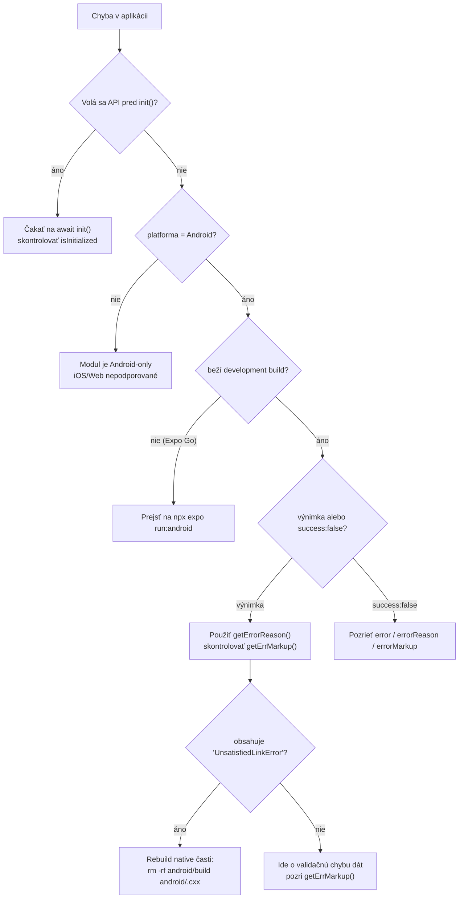

# 07 – Riešenie problémov

## Najčastejšie chyby

| Hlásenie / symptom | Príčina | Riešenie |
|--------------------|---------|----------|
| `GS1 Syntax Engine instance has not been initialized. Call init() first` | Metóda volaná pred `await init()` alebo po `close()` | Vždy najprv `await encoder.init()`; skontrolujte `encoder.isInitialized` |
| `GS1 Syntax Engine has been initialized.` (iba `console.warn`) | Opakované `init()` | Normálne správanie – opakované `init()` nerobí re-inicializáciu. Ak chcete reštartovať, zavolajte `close()` a potom `init()` |
| `Failed to initialize GS1Encoder: ...` | Natívna inicializácia zlyhala (pamäť, chybný `syntaxDictionary`, `noEmbedded` bez tabuľky) | Skontrolujte `InitOptions`; skúste `fallbackOnSyndictError: true`; overte cestu k slovníku |
| `GS1Encoder instance has been closed` | Volanie API po `close()` | Vytvorte novú inštanciu a znova `init()` |
| `Unknown validation value: N` | Do `setValidationEnabled`/`getValidationEnabled` prišla neplatná hodnota | Použite len hodnoty enumu `Validation` (0–5) |
| `Incorrect numeric check digit` | Číselný vstup dĺžky 8/12/13/14 so zlou kontrolnou číslicou | Opravte dáta alebo zadajte vstup v inom formáte (napr. bracketed AI) |
| `GS1 Syntax Engine Error: ... Caused by: ...` | Chyba enginu zachytená `processBarcode()` | Použite `errorReason` – obsahuje text za `Caused by:` |
| `Cannot find native module 'ExpoGs1SyntaxEngine'` / chýbajúca trieda | Modul nie je prelinkovaný do buildu | Použite development build (`npx expo run:android`), nie Expo Go; overte `expo-module.config.json` a autolinking |
| `UnsatisfiedLinkError: Native library 'gs1encoders' ...` | `libgs1encoders.so` sa nepostavilo | Skontrolujte CMake (Android Studio, NDK, CMake ≥ 3.22), prečistite `android/build` a `.cxx` |
| Funkcia nie je na webe | Web je len placeholder | Modul podporuje len Android |
| `init()` zlyháva na iOS | iOS implementácia neexistuje | Modul je Android-only |

## Postup diagnostiky



## Chybové hlásenia enginu a `errorReason`

Java wrapper prepošle chybový text z C enginu; Expo ho ako `Error` doručí do JS. `getErrorReason()` vyberie text **za posledným `Caused by:`**:

```ts
// Pôvodné hlásenie (verbose)
// "GS1EncoderParameterException: ... Caused by: Invalid AI content in (11)"

encoder.getErrorReason(err); // 'Invalid AI content in (11)'
```

Pri `processBarcode()` túto hodnotu dostanete priamo:

```ts
const r = encoder.processBarcode(data);
if (!r.success) {
  console.log(r.error);       // markup alebo plné hlásenie
  console.log(r.errorReason); // skrátená príčina
}
```

## Interpretácia `errMarkup`

`getErrMarkup()` (resp. pole `errorMarkup` vo výsledku) označuje problematickú časť vstupu:

| Význam | Príklad |
|--------|---------|
| Vinné znaky obklopené `\|` | `(11) \|211313\|` |
| Celá hodnota AI obklopená `\|` | ak jednotlivé znaky nedávajú zmysel |
| Prázdny reťazec | žiadna lint chyba |

## Obmedzenia a úskalia

| # | Obmedzenie | Dôsledok / obchodné riešenie |
|---|-----------|------------------------------|
| 1 | **Podporovaná je len Android** | iOS a web modul nefungujú (`expo-module.config.json` → `platforms: ["android"]`) |
| 2 | **Expo Go nepodporované** | Vyžaduje development build / EAS Build |
| 3 | `symbology` / `symbologyName` / `scanData` sú `null` pri všetkých okrem scan data formátu | Ak potrebujete typ kódu, vyžiadajte vstup s AIM prefixom `]` |
| 4 | AIM prefix `]E` a `]I` sa odreže | Symbology nebude určená; uloží sa len `aimPrefix` |
| 5 | `parseHRIString()` neparsuje hodnoty **s medzerami** | Také páry sa nedostanú do `aiDataPairs`; použite `hri[]` (pole riadkov) |
| 6 | `aiOrder` môže obsahovať **dierové pozície** | Pri JSON serializácii sa prejavia ako `null` – ošetrite pri mapovaní |
| 7 | `aiDataPairs` je objekt – **duplicitné AI sa prepisujú** | Pri opakovanom AI v HRI ostane posledná hodnota |
| 8 | `version` vracia **dátum buildu** C knižnice, nie semver | Pre verziu JS API použite `package.json` balíka |
| 9 | `get*` volania sú **synchronné** cez bridge | Veľké výstupy (HRI) môžu spomaliť UI vlákno – nevolajte ich v `render` cykle |
| 10 | Bez `close()` ostáva C kontext alokovaný | Vždy zatvárajte inštanciu v cleanup funkcii |
| 11 | `permitUnknownAIs` neplatí pre raw (nebracketed) vstupy | Neznámne AI v raw element stringu nie je možné parsovať |
| 12 | Zero-suppressed GTIN sú deprecated | `permitZeroSuppressedGTINinDLuris` povoľte len pre legacy dáta |
| 13 | Zdieľanie inštancie medzi vláknami nie je bezpečné | 1 inštancia = 1 vlákno |
| 14 | Skript `npm test` volá `jest`, ktorý nie je v `devDependencies` | V repozitári momentálne nie sú žiadne unit testy (jest bol odstránený vo `v0.1.6`) |

## Často kladené otázky (FAQ)

**Prečo `success: false`, hoci dáta vyzerajú správne?**
`success` je `true` len ak je `errMarkup` prázdny. Skontrolujte `error`/`errorReason` – ide o lint chybu AI (napr. neplatný dátum, chýbajúca povinná AI).

**Ako získam typ čiarového kódu?**
Iba ak vstup príde ako scan data (prefix `]`). Potom čítajte `symbology` (číslo) alebo `symbologyName` (text).

**Prečo je `dlUri` prázdne/`null`?**
`getDLuri()` vyžaduje dáta, z ktorých sa dá DL URI zostaviť (musí obsahovať AI (01) prípadne ďalšie povinné AI pre daný stem typ). Inak hodí `GS1EncoderDigitalLinkException`.

**Môžem použiť viac inštancií naraz?**
Áno – každá inštancia je samostatný natívny kontext. Pamäť však uvoľňujte (`close()`).

**Ako aktualizujem GS1 Syntax Engine na novšiu verziu?**
Pozri [08-nativna-vrstva-android.md](./08-nativna-vrstva-android.md) → „Aktualizácia GS1 Syntax Engine“.

**Kde nájdem príklad celého riešenia?**
[`../example/App.tsx`](../example/App.tsx) a repozitár [expo-gs1-s-e-example](https://github.com/GS1SlovakiaOrg/expo-gs1-s-e-example).

**Podporuje modul iOS?**
Nie. Pridanie iOS si vyžaduje vytvoriť priečinok `ios/`, pridať `GS1Encoder` wrapper pre Objective-C/Swift, JNI (alebo iný bridging) a rozšíriť `platforms` v `expo-module.config.json`.

## Oznamovanie problémov

Issues: <https://github.com/GS1SlovakiaOrg/expo-gs1-syntax-engine/issues>
