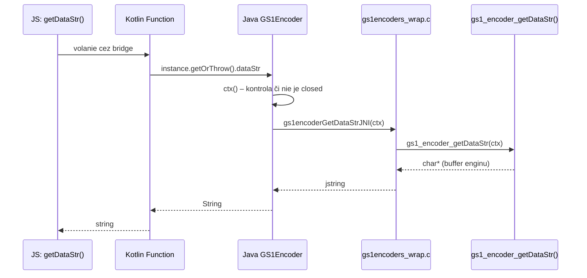

# 08 – Nativná vrstva (Android)

Celá natívna časť modulu leží v `android/`. iOS priečinok **neexistuje**.

## Štruktúra `android/`

```
android/
├── build.gradle                       # knižnica + CMake externý build
├── src/main/
│   ├── AndroidManifest.xml
│   ├── cpp/
│   │   ├── CMakeLists.txt             # build libgs1encoders.so
│   │   └── gs1encoders_wrap.c         # JNI most (C ↔ Java)
│   ├── c-lib/                         # GS1 Barcode Syntax Engine (C zdroje)
│   │   ├── gs1encoders.c / .h / .hpp  # verejné C API
│   │   ├── ai.c, dl.c, scandata.c, syn.c
│   │   ├── aitable.inc                # embedded AI tabuľka
│   │   ├── gs1-syntax-dictionary.txt  # ukážka Syntax Dictionary
│   │   ├── syntax/                    # gs1syntaxdictionary.c + lint_*.c linter
│   │   ├── *_test.c, fuzzer*.c        # testy (nebuildujú sa cez CMake)
│   │   └── Makefile, *.vcxproj        # desktop buildy (Windows/Make)
│   └── java/expo/modules/gs1syntaxengine/
│       ├── ExpoGs1SyntaxEngineModule.kt   # Expo modul (ModuleDefinition)
│       ├── GS1Encoder.java                # Java wrapper (package org.gs1.gs1encoders)
│       ├── GS1EncoderGeneralException.java
│       ├── GS1EncoderParameterException.java
│       ├── GS1EncoderScanDataException.java
│       ├── GS1EncoderDigitalLinkException.java
│       ├── package-info.java
│       └── readme.md                  # postup aktualizácie enginu
```

> ⚠️ Java súbory majú deklarovaný package `org.gs1.gs1encoders`, ale fyzicky ležia v priečinku `expo/modules/gs1syntaxengine`. Gradle to toleruje (zdrojové súbory nemusia zodpovedať štruktúre priečinkov), pri presúvaní súborov to však treba mať na pamäti.

---

## Expo modul (Kotlin)

Súbor: `android/src/main/java/expo/modules/gs1syntaxengine/ExpoGs1SyntaxEngineModule.kt`

### Definícia modulu

```kotlin
override fun definition() = ModuleDefinition {
  Name("ExpoGs1SyntaxEngine")          // meno musí sedieť s requireNativeModule(...)
  Class(EncoderInstance::class) { ... }
}
```

| Konštrukt | Použitie | Správanie v JS |
|-----------|----------|----------------|
| `Name("ExpoGs1SyntaxEngine")` | meno modulu | `requireNativeModule('ExpoGs1SyntaxEngine')` |
| `Class(EncoderInstance::class)` | zdieľaná trieda (SharedObject) | `new GS1EncoderNativeInstance()` |
| `Constructor { ... }` | vytvorenie inštancie | volá sa z JS konštruktora |
| `AsyncFunction("init")` | asynchrónna funkcia | vracia `Promise` |
| `Function("...")` | synchronné funkcie | volanie cez bridge, okamžitý návrat |

### `EncoderInstance : SharedObject`

```kotlin
class EncoderInstance : SharedObject() {
  var encoder: GS1Encoder? = null

  fun getOrThrow(): GS1Encoder =
    encoder ?: throw IllegalStateException(
      "GS1Encoder instance has not been initialized. Call init() first.")

  override fun deallocate() {
    encoder?.close()   // automatické uvoľnenie pri GC
    encoder = null
  }
}
```

- Drží referenciu na Java `GS1Encoder`.
- `getOrThrow()` je poistka pre všetky volania pred `init()`.
- `deallocate()` zabezpečuje, že natívny C kontext nebude unikať.

### `NativeInitOptions : Record`

```kotlin
class NativeInitOptions : Record {
  @Field var syntaxDictionary: String? = null
  @Field var fallbackOnSyndictError: Boolean = false
  @Field var noEmbedded: Boolean = false
}
```

Zodpovedá TS typu `InitOptions`. Kotlin ho prevádza na `GS1Encoder.InitOptions`:

```kotlin
AsyncFunction("init") { instance: EncoderInstance, options: NativeInitOptions? ->
  try {
    instance.encoder?.close()                       // uvoľnenie predchádzajúcej inštancie
    val initOptions = options?.let { ... }
    instance.encoder = GS1Encoder(initOptions)
  } catch (e: Exception) {
    throw Exception("Failed to initialize GS1Encoder: ${e.message}", e)
  }
}
```

### Prevody enum hodnôt

```kotlin
private fun symbologyFromInt(value: Int): GS1Encoder.Symbology =
  GS1Encoder.Symbology.values().firstOrNull { it.value == value }
    ?: GS1Encoder.Symbology.NONE          // neznáma hodnota → NONE

private fun validationFromInt(value: Int): GS1Encoder.Validation =
  GS1Encoder.Validation.values().firstOrNull { it.value == value }
    ?: throw IllegalArgumentException("Unknown validation value: $value")
```

### Zoznam exportovaných funkcií

| Kategória | Funkcie |
|-----------|---------|
| Životný cyklus | `init` (async), `close`, `getVersion`, `getInitFallbackWarning` |
| Vlastnosti | `getSym`/`setSym`, `getAddCheckDigit`/`setAddCheckDigit`, `getIncludeDataTitlesInHRI`/`setIncludeDataTitlesInHRI`, `getPermitUnknownAIs`/`setPermitUnknownAIs`, `getPermitZeroSuppressedGTINinDLuris`/`setPermitZeroSuppressedGTINinDLuris` |
| Validácie | `getValidationEnabled`, `setValidationEnabled` |
| Vstupy | `getDataStr`/`setDataStr`, `getAIdataStr`/`setAIdataStr`, `getScanData`/`setScanData` |
| Výstupy | `getErrMarkup`, `getDLuri`, `getHRI`, `getDLignoredQueryParams` |

⚠️ **Nie je exportované:** `getValidateAIassociations()` / `setValidateAIassociations()` – v Jave sú označené `@Deprecated` a sú len aliasom `RequisiteAIs`.

---

## Java wrapper: `GS1Encoder.java`

Súbor: `android/src/main/java/expo/modules/gs1syntaxengine/GS1Encoder.java` (package `org.gs1.gs1encoders`)

### Úlohy

1. **Deklaruje natívne metódy** (`private static native ... JNI`).
2. **Načíta natívnu knižnicu** cez vnorenú triedu `NativeLibraryLoader`.
3. **Prevádza návratové hodnoty na výnimky** (C API vracia `bool`/`NULL` + chybový text).
4. **Chráni kontext** cez `ctx()`:

```java
private long ctx() {
    if (ctx == 0)
        throw new IllegalStateException("GS1Encoder instance has been closed");
    return ctx;
}
```

### JNI metódy (výber)

```java
private static native long   gs1encoderInitExJNI(InitOptions initOptions, String[] outErrorMessage);
private static native void   gs1encoderFreeJNI(long ctx);
private static native String gs1encoderGetVersionJNI();
private static native boolean gs1encoderSetDataStrJNI(long ctx, String value);
private static native String[] gs1encoderGetHRIJNI(long ctx);
// ... dokopy 26 deklarovaných native metód
```

### Načítanie `libgs1encoders.so`

```java
static { NativeLibraryLoader.load("gs1encoders"); }
```

Postup (`NativeLibraryLoader`):
1. `System.loadLibrary("gs1encoders")` – hľadá knižnicu na system library path (štandardný Android prípad; AAR/Gradle ju rozbalí automaticky).
2. Pri zlyhaní hľadá bundlovanú kópiu pod `/META-INF/lib/<os>_<arch>/` (pre desktop JAR) a extrahuje ju dočasného súboru.

Na Androide vždy stačí krok 1.

### Výnimky

| Trieda | Vzniká pri |
|--------|------------|
| `GS1EncoderGeneralException` | Zlyhanie inicializácie (`ctx == 0`) |
| `GS1EncoderParameterException` | `setDataStr` / `setAIdataStr` / `setSym` / `set*` vrátili `false` |
| `GS1EncoderScanDataException` | `setScanData` / `getScanData` zlyhalo |
| `GS1EncoderDigitalLinkException` | `getDLuri` vrátil `null` |

Všetky sú odvodené od `Exception` a nesú text z `gs1_encoder_getErrMsg()`.

### Enumy

- `GS1Encoder.Symbology` (hodnoty `-1 … 15`) + `getValue()` / `fromValue(int)`
- `GS1Encoder.Validation` (hodnoty `0 … 5`) + `getValue()` / `fromValue(int)`

Musia presne zodpovedať C enumom `gs1_encoder_symbologies` a `gs1_encoder_validations`.

---

## C vrstva

### CMake build

`android/src/main/cpp/CMakeLists.txt`:

```cmake
cmake_minimum_required (VERSION 3.22)
project (gs1encoders)

file(GLOB LIB_SOURCE_FILES
  ../c-lib/ai.c
  ../c-lib/dl.c
  ../c-lib/scandata.c
  ../c-lib/syn.c
  ../c-lib/gs1encoders.c
  ../c-lib/syntax/gs1syntaxdictionary.c
  ../c-lib/syntax/lint_*.c
)

add_compile_definitions(GS1_LINTER_ERR_STR_EN)

add_library(gs1encoders SHARED ${LIB_SOURCE_FILES} gs1encoders_wrap.c)
target_include_directories(gs1encoders PRIVATE gs1encoders ../c-lib)
```

| Voľba | Význam |
|-------|--------|
| `GS1_LINTER_ERR_STR_EN` | Chybové hlásenia lintera v **angličtine** |
| `lint_*.c` | Jednotlivé validačné procedúry (dátum, krajina, mena, kontrolná číslica, IBAN, ISO 4217, ISO 3166, latitude/longitude, …) |
| `SHARED` | Výsledkom je `libgs1encoders.so` pre každú ABI |

Testovacie súbory (`gs1encoders-test.c`, `gs1encoders-fuzzer-*.c`) sa do Android buildu **nezapočítavajú**.

### JNI most

`android/src/main/cpp/gs1encoders_wrap.c` – prevádza JNI volania (`Java_org_gs1_gs1encoders_GS1Encoder_*JNI`) na volania C API (`gs1_encoder_*`), spravuje preklad reťazcov a chybové stavy.

### Verejné C API (výber)

```c
char*  gs1_encoder_getVersion(void);
gs1_encoder* gs1_encoder_init_ex(void *mem, const gs1_encoder_init_opts_t *opts);
void   gs1_encoder_free(gs1_encoder *ctx);
bool   gs1_encoder_setDataStr(gs1_encoder *ctx, const char *dataStr);
bool   gs1_encoder_setAIdataStr(gs1_encoder *ctx, const char *dataStr);
bool   gs1_encoder_setScanData(gs1_encoder *ctx, const char *scanData);
char*  gs1_encoder_getErrMarkup(gs1_encoder *ctx);
char*  gs1_encoder_getDLuri(gs1_encoder *ctx, const char *stem);
int    gs1_encoder_getHRI(gs1_encoder *ctx, char ***hri);
int    gs1_encoder_getDLignoredQueryParams(gs1_encoder *ctx, char ***qp);
```

**Stav inicializácie (C):**

| Kód | Význam |
|-----|--------|
| `0` | `GS1_ENCODERS_INIT_SUCCESS` |
| `1` | `GS1_ENCODERS_INIT_FALLBACK_TO_EMBEDDED_TABLE` |
| `-1` | `FAILED_NO_MEM` |
| `-2` | `FAILED_NO_EMBEDDED_TABLE` |
| `-3` | `FAILED_LOADING_SYNDICT` |
| `-4` | `FAILED_AI_TABLE_CORRUPT` |

---

## Reťazec prevodu jedného volania



---

## Aktualizácia GS1 Syntax Engine

Postup je zachovaný v troch identických `readme.md` súboroch (`android/src/main/readme.md`, `android/src/main/cpp/readme.md`, `android/src/main/java/expo/modules/gs1syntaxengine/readme.md`):

1. **`cpp/gs1encoders_wrap.c`** – skopírovať z `/src/java/gs1encoders_wrap.c` v originálnom projekte.
2. **`c-lib/`** – skopírovať priečinok z `/src/`.
3. **`java/expo/modules/gs1syntaxengine/`** – skopírovať priečinok `/src/java/org/gs1/gs1encoders`.

Po aktualizácii:

1. Overiť, či sa **nemenili C API podpisy** – inak je potrebné upraviť `gs1encoders_wrap.c` a `GS1Encoder.java`.
2. Overiť zhodu **enum hodnôt** (`Symbology`, `Validation`) medzi C, Java a TS (`src/ExpoGs1SyntaxEngine.types.ts`).
3. Prípadne doplniť nové `InitOptions` polia (C → Java → Kotlin `Record` → TS typ).
4. Prečistiť build: `npm run clean` + odstrániť `android/build` a `android/.cxx`.
5. Zrebuildovať príkladovú aplikáciu (`npx expo run:android`).

Momentálne používaná verzia enginu: **1.4.1**.

---

## Kontrolný zoznam pri pridaní novej funkcionality

- [ ] Pridať metódu do **C API** + wrap (`gs1encoders_wrap.c`)
- [ ] Pridať `private static native` deklaráciu a verejnú metódu do **`GS1Encoder.java`** (s výnimkou pri chybe)
- [ ] Pridať `Function(...)` do **`ExpoGs1SyntaxEngineModule.kt`**
- [ ] Pridať wrapper metódu/`get`+`set` do **`src/index.ts`** vrátane `ensureInitialized()` a JSDoc
- [ ] Ak ide o nový typ/enum – pridať do **`src/ExpoGs1SyntaxEngine.types.ts`** a exportovať v `src/index.ts`
- [ ] Aktualizovať **dokumentáciu** a `changelog.md`
